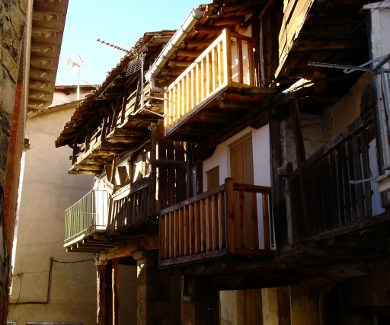

  
## {{ page.title }}

  La organización os puede proporcinar tanto **alojamiento en casas particulares** en la zona como **conductores** a un precio razonable. Si estáis interesados contactar con **Armando** (686 13 69 94, armando@flytietar.com).

  En la zona existen multitud de casas rurales y campings. La mayor parte de la oferta existente en **Pedro Bernardo** la podéis encontrar en <a target="_blank" href="http://clubdevuelopb.com/alojamiento.html">la página de <em>Alojamiento</em> del Club de Vuelo y Montaña</a>.

  

&nbsp;

