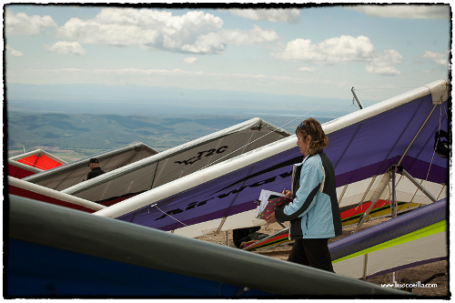

<h2>Apresentação <a href="presentacion.html">Presentación</a></h2>

Olá a todos desde Pedro Bernardo, um local fantástico para a prática do voo livre situado na Cordilheira Central da Península Ibérica, na encosta Sul da **Serra de Gredos** que se eleva sobre um bonito vale banhado pelo rio Tietar.

Vimos convidar-vos a participar no **III Open Internacional FAI de Asa Delta de Pedro Bernardo** que terá lugar nos dias **1, 2, 3 e 4 de Maio**.

Esperamos ver-vos nestas datas por Pedro Bernardo e partilhar convosco as **magníficas condições para o voo livre** que temos neste local, com boas e bonitas provas que nos façam disfrutar de grandes voos.

Contamos com a participação de todos os pilotos que desejem disfrutar deste Open de Asa Delta e para isso temos unicamente duas classes:

* **Open:** classificação aberta a todos os participantes; asas sem “kingpost”, rígidas (com uma correspondente penalização) e sport.
* **Sport:** classificação para asas delta sport (com kingpost e, teoricamente, para pilotos menos experientes).

Para podermos organizar o evento em condições aceitáveis estabelecemos um preço de [inscrição](inscripcion.html) **40€** (ver [Regulamento e Notas](regulamento.html)).

**Um abraço a todos, vêmo-nos no ar.**
