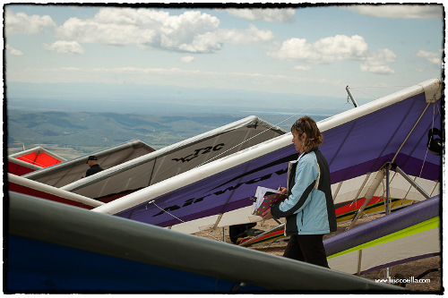

<h2>Presentación <a href="apresentacao.html">Apresentação</a></h2>

Hola a todo el mundo desde Pedro Bernardo, un fantástico lugar para la práctica del vuelo libre situado en el Sistema Central de la Península Ibérica, en la cara sur de **La Sierra de Gredos** la cual se eleva sobre un precioso valle bañado por el río Tiétar.

Os invitamos a venir a participar en el **III Open Internacional FAI de Ala Delta de Pedro Bernardo** que se celebrará los días **1, 2, 3 y 4 de Mayo**.

Esperamos veros en estas fechas por Pedro Bernardo y compartir con todos vosotros las **magníficas condiciones para el vuelo libre** que se dan en este lugar, con buenas y bonitas pruebas que nos hagan disfrutar de grandes vuelos.

Contamos con  la participación de todos los pilotos que deseen disfrutar en este Open de Ala Delta y para ello tenemos únicamente dos categorías:

* **Open**: clasificación abierta a todos los participantes; calvas, rígidas (con su correspondiente penalización) y sport.

* **Sport**: clasificación para alas delta sport (con mástil y, en teoría, pilotos menos expertos)

Para poder organizar todo el evento en condiciones hemos puesto una cuota de [inscripción](inscripcion.html "Formulario de inscripción") de **40€** (ver [Notas y Reglamento](reglamento.html)).

**Un abrazo a todos, nos vemos volando.**

